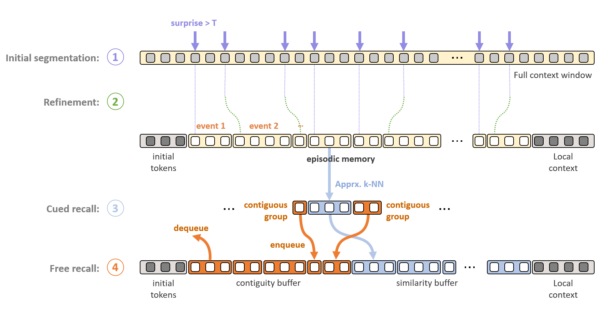

# Reach00 (PS-EM-LLM): Human-like Pattern Separation Enhanced Episodic Memory for Infinite Context LLMs

This repository contains an enhanced version of EM-LLM ([original paper](https://arxiv.org/abs/2407.09450)) that incorporates hippocampal pattern separation mechanisms to improve event distinctiveness.

### EM-LLM Architecture
<div align="center">

  

</div>

**Figure 1:**  Architecture of memory formation and retrieval in each LLM layer. *Formation:* Input sequence is initially segmented via surprise (purple dashed lines in ①), then segmentation is refined based on group theoretic metrics (green dashed lines in ②). Initial tokens and local context are preserved. *Retrieval:* via both k-NN search ③ and selecting contiguous events from episodic memory ④.

## Citation

If you use this pattern separation enhanced version, please cite both the original EM-LLM paper and this work:

```
@misc{fountas2024humanlikeepisodicmemoryinfinite,
      title={Human-like Episodic Memory for Infinite Context LLMs}, 
      author={Zafeirios Fountas and Martin A Benfeghoul and Adnan Oomerjee and Fenia Christopoulou and Gerasimos Lampouras and Haitham Bou-Ammar and Jun Wang},
      year={2024},
      eprint={2407.09450},
      archivePrefix={arXiv},
      primaryClass={cs.AI},
      url={https://arxiv.org/abs/2407.09450}, 
}
@misc{yourname2024patternseparation,
      title={Human-like Pattern Separation Enhanced Episodic Memory for Infinite Context LLMs}, 
      author={Arron Stothart},
      year={2024},
      url={https://github.com/Arron-Stothart/reach00},
}
```